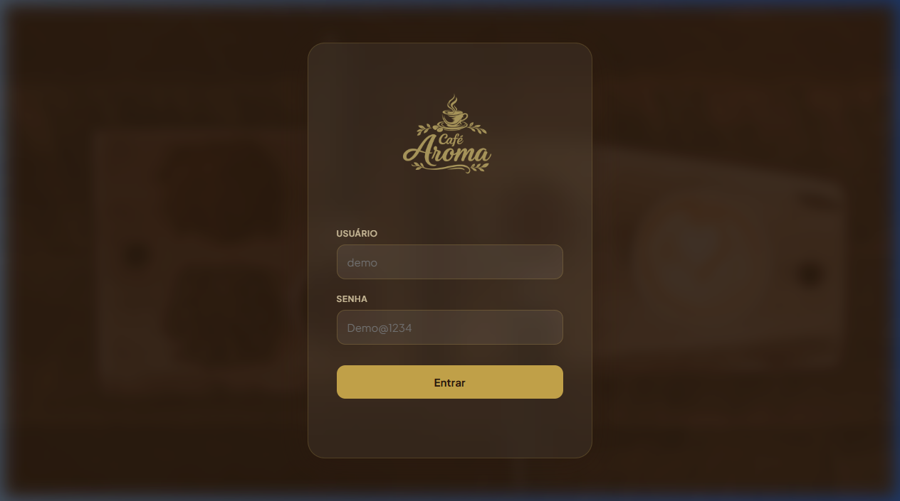
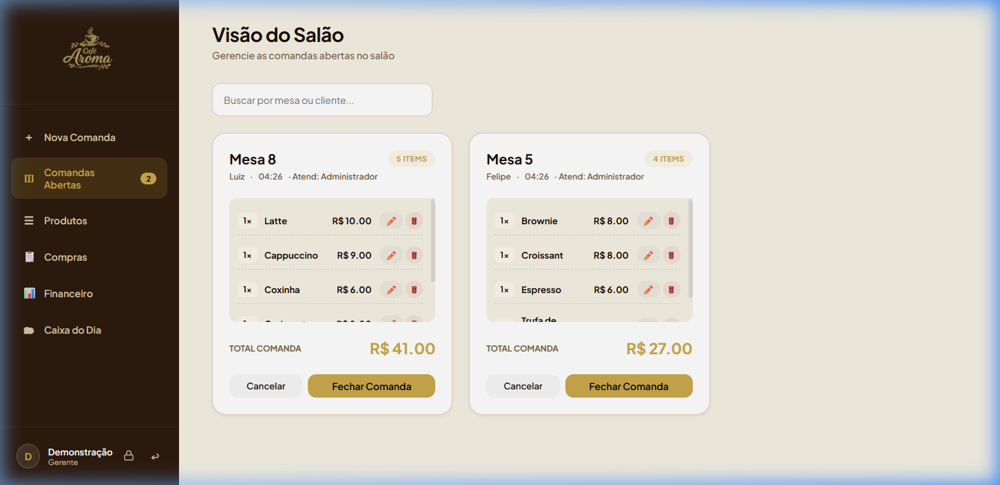
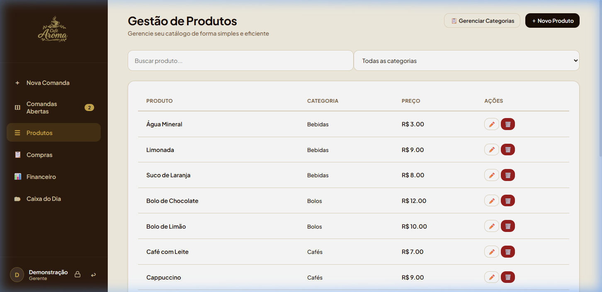
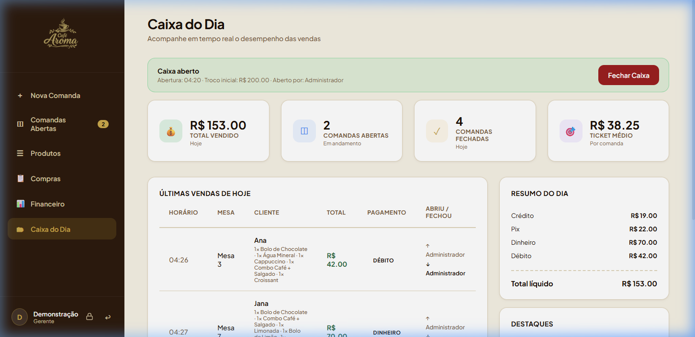
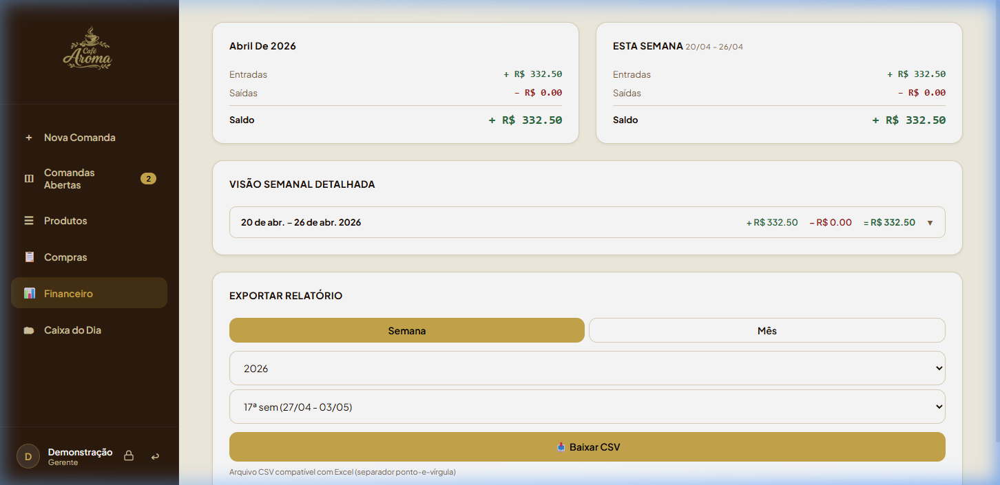

# Café Aroma — Sistema de Gestão para Cafeteria

> PDV e gestão operacional completo: comandas, caixa, produtos, compras, fornecedores e relatórios financeiros.


---

## Demo ao vivo

**[cafe-aroma-portfolio.vercel.app](https://cafe-aroma-portfolio.vercel.app)**

| Usuário | Senha | Acesso |
|---------|-------|--------|
| `demo` | `Demo@1234` | Todas as telas (somente leitura) |

> Para testar escrita, rode localmente com o usuário `admin`.



---

## Funcionalidades

| Módulo | Destaques |
|--------|-----------|
| **Comandas** | Abertura, edição de itens, divisão de conta, desconto gerencial, fechamento com forma de pagamento e troco |
| **Caixa** | Abertura com fundo inicial, fechamento com conferência física, resumo por forma de pagamento |
| **Produtos** | CRUD completo com soft delete, organizado por categorias |
| **Compras** | Registro de NF, controle de pagamento, upload de foto, gestão de fornecedores |
| **Relatórios** | Ticket médio, horário de pico, produtos mais vendidos |
| **Usuários** | Três perfis com permissões distintas: Gerente, Atendente e Financeiro |

**Visão do Salão** — comandas abertas por mesa, com itens, totais e ações em tempo real:



**Gestão de Produtos** — catálogo com filtro por categoria e CRUD inline:



**Caixa do Dia** — dashboard em tempo real com ticket médio, formas de pagamento e últimas vendas:



**Financeiro** — resumo mensal/semanal de entradas, saídas e exportação para CSV:



---

## Arquitetura

```
Frontend (SPA vanilla) ──► Express REST API ──► PostgreSQL (Supabase)
```

- **SPA sem framework** — navegação entre telas via JS puro, sem reload de página
- **REST API** com rotas separadas por domínio (`/api/comandas`, `/api/caixa`, `/api/produtos`…)
- **Middleware chain**: Helmet → Rate Limit → JWT Auth → Role Check → Demo Guard → Handler

---

## Segurança

- JWT com expiração de 8h e validação de comprimento mínimo (32 chars)
- Rate limiting no login e na verificação de senha gerencial (5 tentativas / 15 min)
- bcrypt com salt 10 — senhas exigem mínimo 8 chars, maiúscula, número e especial
- Controle de acesso por perfil em todas as rotas sensíveis
- Demo guard: bloqueia qualquer escrita (`POST/PUT/DELETE`) no ambiente de demo
- Helmet.js para headers HTTP (CSP, X-Frame-Options, HSTS, etc.)
- Reset automático diário via GitHub Actions para proteger o banco gratuito (Supabase free tier)

---

## Setup local

**Pré-requisitos:** Node.js 14+ e acesso a um PostgreSQL (local ou Supabase).

```bash
git clone https://github.com/wleal-dev/cafe-aroma-portfolio
cd cafe-aroma-portfolio/backend
cp .env.example .env    # ajuste DATABASE_URL
npm install
node seed.js            # cria tabelas e popula dados de demo
npm run dev             # http://localhost:3000
```

| Usuário | Senha | Perfil |
|---------|-------|--------|
| `admin` | `Admin@1234` | Gerente (acesso total) |
| `caixa` | `Caixa@1234` | Atendente |
| `demo`  | `Demo@1234`  | Gerente (somente leitura) |

---

## Estrutura do projeto

```
├── index.html                  # SPA principal
├── app.js                      # Lógica do frontend
├── styles.css                  # Design system
├── vercel.json                 # Configuração de deploy
├── .github/workflows/
│   └── reset-demo.yml          # Reset diário do banco demo
└── backend/
    ├── server.js               # Entry point Express
    ├── db.js                   # Pool de conexão PostgreSQL
    ├── schema.sql              # Schema do banco
    ├── seed.js                 # Popula banco com dados de demonstração
    ├── middleware/
    │   ├── auth.js             # Verificação JWT
    │   ├── checkRole.js        # Controle de acesso por perfil
    │   └── demoGuard.js        # Bloqueia escrita no modo demo
    └── routes/                 # auth, admin, produtos, comandas, caixa…
```

---

<details>
<summary><strong>Deploy online (Supabase + Vercel)</strong></summary>

### 1. Banco — Supabase

1. Crie um projeto em [supabase.com](https://supabase.com) (free tier)
2. Copie a connection string em **Project Settings → Database → URI**
3. Rode o seed apontando para o Supabase:
   ```bash
   DATABASE_URL="postgresql://postgres:<senha>@db.<projeto>.supabase.co:5432/postgres" \
   SENHA_ADMIN=Admin@1234 SENHA_CAIXA=Caixa@1234 \
   node backend/seed.js
   ```

### 2. Servidor — Vercel

1. Conecte o repositório no [vercel.com](https://vercel.com)
2. Configure as variáveis de ambiente:

| Variável | Descrição |
|----------|-----------|
| `DATABASE_URL` | Connection string do Supabase |
| `JWT_SECRET` | Secret aleatório (32+ chars) |
| `SENHA_ADMIN` | Senha do admin |
| `SENHA_CAIXA` | Senha do caixa |
| `RESET_SECRET` | Secret para o endpoint de reset |
| `DEMO_MODE` | `true` para bloquear escrita de todos os usuários |

3. Faça push — Vercel realiza o deploy automaticamente.

### 3. Reset automático

O workflow `.github/workflows/reset-demo.yml` reseta o banco diariamente às 3h BRT.
Configure o secret `RESET_SECRET` em **Settings → Secrets → Actions** do repositório.

</details>
